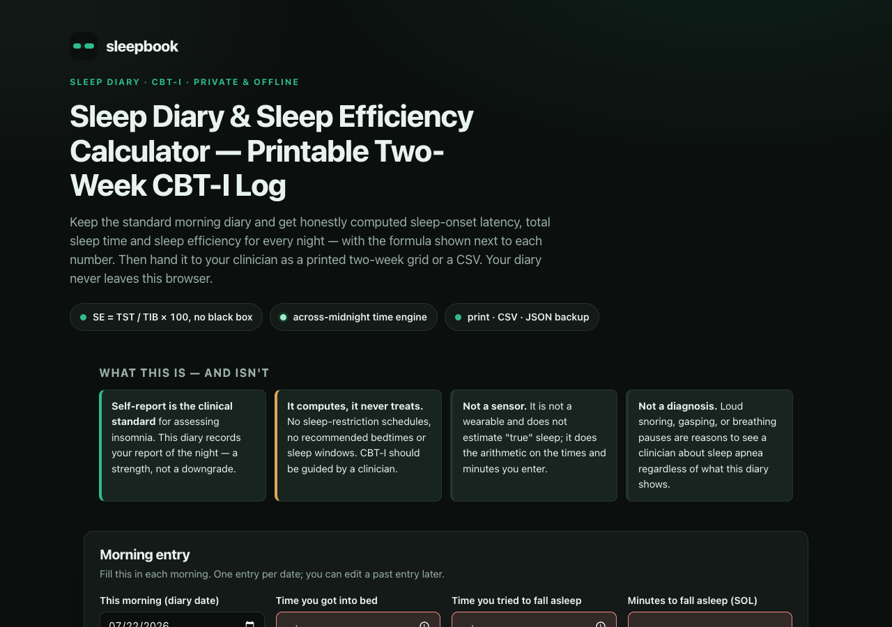

# sleepbook

**Sleep Diary & Sleep Efficiency Calculator — a printable two-week CBT-I log.** Keep the
standard morning sleep diary and get honestly computed sleep-onset latency, total sleep
time, and sleep efficiency for every night — with the formula shown next to each number —
then hand it to a clinician as a printed two-week grid or a CSV. 100% client-side, zero
dependencies, works fully offline.



## Why

Search "sleep diary template" and you get static printables that can't compute anything —
you still do the arithmetic by hand. People doing CBT-I for insomnia (clinician-referred or
self-starting) have to keep a diary every morning for weeks, and every night needs SOL, TST,
and sleep efficiency worked out correctly, including the awkward across-midnight time math.

sleepbook is the diary that does the arithmetic. You enter the ten standard morning fields;
it computes the derived measures per night, shows the formula so nothing is a black box,
draws the two-week grid your clinic expects, and never lets a broken time sequence produce a
negative or impossible number.

## Features

- **Standard morning diary** — the ten standard sleep-diary fields (into-bed time, lights-out,
  minutes to fall asleep, awakenings, mid-night minutes awake, final-wake time, out-of-bed
  time, quality 1–5, note) with inline validation and human error messages. Field definitions
  and help text are a generic implementation of the standard items, cross-checked against
  published CBT-I / consensus-sleep-diary descriptions.
- **Honest per-night math** — pre-sleep wait, time in bed (TIB), early-rise minutes, total
  sleep time (TST), and sleep efficiency (SE = TST ÷ TIB × 100), each printed with its formula.
- **Across-midnight time engine** — pure HH:MM clock arithmetic that adds a full day when a
  later event reads an earlier clock time, and **rejects impossible sequences** with named
  errors (sleep-period overflow, final-wake after out-of-bed, ambiguous zero-length night,
  or a duration beyond a plausible bound). The UI can never show a negative TST or SE.
- **Two-week grid** — the most recent 14 nights, each row carrying a proportional **night
  strip** (jade = asleep, ink gaps = awake), with 7-day and 14-day average rows for SE, TST,
  SOL, and WASO computed over logged nights only.
- **Trend chart** — inline-SVG lines of sleep efficiency and total sleep time across every
  logged night. No chart library, no network.
- **Clinic handoff** — a print stylesheet that reproduces the grid on one A4/Letter page with
  a name and date-range header and averages row.
- **Export & backup** — RFC-4180 CSV (raw + derived columns) and a full JSON backup/restore.
- **Persistence** — your diary is saved in `localStorage`, keyed per morning date, with
  edit-past-entry support.

## Quickstart

Just open `index.html` in any modern browser — no build step, no server, no install.

- **Local:** double-click `index.html`, or run a static server in the folder.
- **Hosted:** **[Open sleepbook live](https://sreenivas-sadhu-prabhakara.github.io/sleepbook/)**

Fill in each morning; save the night; it appears in the grid and trend. Print or export when
your clinician asks for the two weeks.

## The math (verified)

- **Sleep efficiency:** `SE = TST / TIB × 100`, rounded to one decimal place.
- **Total sleep time:** `TST = TIB − pre-sleep wait − SOL − WASO − early-rise minutes`.
- The field set and the SE formula were **verified on 2026-07-22** against two published
  sources: the Consensus Sleep Diary (Carney et al., 2012) and a published CBT-I
  sleep-efficiency description. See [`sources/CITATIONS.md`](./sources/CITATIONS.md). The
  worked-example fixtures and the plausibility caps are our own, computed by hand and asserted
  in `test/engine.test.js`.

Run the self-tests (Node 20+):

```sh
node --test
```

They re-derive every formula, assert all 12 worked fixtures to the minute, verify the
across-midnight and exact-midnight boundaries, prove the CSV round-trip (RFC-4180), fuzz
5,000 seeded valid nights against the partition identity `pre-sleep + SOL + WASO + EMA + TST
= TIB`, and confirm the clock math is timezone-independent.

## Privacy

sleepbook is built to be private by construction — health data should not leak.

- A strict Content-Security-Policy sets `connect-src 'none'`: the app **cannot** make any
  network request even if it tried.
- No external fonts, scripts, images, or analytics. Everything is self-contained.
- Your diary is stored only in this browser's `localStorage` and never leaves your device.
- Because there are no network dependencies, it works with **no signal at all** — and there is
  no service worker, no account, no cloud sync, and no share link. Print / CSV / JSON are the
  only ways data leaves the app.

## Honest limits

- **Self-report only** — and that is the clinical standard for insomnia assessment, not a
  downgrade. This diary records your report of the night, not a sensor estimate of "true" sleep.
- **Computes, never treats** — no sleep-restriction schedules or bedtime prescriptions. CBT-I
  should be guided by a clinician.
- **Fixed 24-hour clock** — on the two daylight-saving-transition nights a year, time-derived
  durations can be off by up to an hour. This is documented, not auto-corrected.
- **Local storage only** — clearing site data deletes your diary; use the JSON backup.
- **Not a medical device and not a diagnosis** — loud snoring, gasping, or breathing pauses are
  reasons to see a clinician about sleep apnea regardless of what this diary shows.
- **Generic fields** — a generic implementation of standard sleep-diary items, not the
  Consensus Sleep Diary instrument itself.
- **One main sleep period per night** — naps and shift-work multi-sleep episodes are not modeled
  in v0.1; put naps in the note field.

## Disclaimer

sleepbook is an informational sleep-diary calculator for educational purposes only. It is not
medical advice, diagnosis, or treatment, and it is not a medical device. Sleep efficiency is
reported as the published standard `SE = total sleep time ÷ time in bed × 100`; it is not
interpreted against any clinical threshold. Always discuss your sleep and any CBT-I plan with a
qualified clinician. This software is provided under the MIT License, "as is", without warranty
of any kind; the author accepts no liability for any loss, injury, or damage arising from its
use.

## License

[MIT](./LICENSE) © 2026 Sreenivas Sadhu Prabhakara
